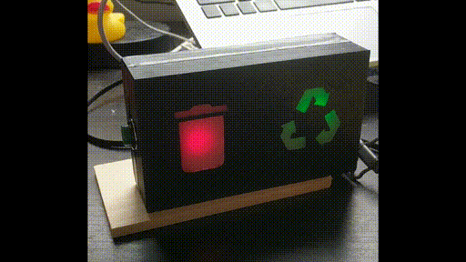

# IoT Garbage Collection Sign
A simple sign that indicates whether the trash and/or recycling is being collected tomorrow by blinking a light for each. 
The lights will stop blinking when the button on the side is pressed. If an error is encountered while retrieving the trash
schedule the blinking lights will alternate rapidly. The code is a node.js script designed to run on a Raspberry pi. The script makes an API call to a [Google Cloud Function](https://github.com/sfgarza/sd-trash-schedule-function) in order to retrieve the garbage collection schedule.

#### Usage:
 POSTURL=https://yourcloudfunctionurl.net/trash-schedule node index.js --streetnum=123 --streetname=Main --streetsuffix=St --apikey=XXXXXXXXX
  
#### Suggested Crontab:
 00 17 * * * /usr/local/bin/node POSTURL=https://yourcloudfunctionurl.net/trash-schedule /home/pi/iot-garbage-collection-sign/index.js  --streetnum=123 --streetname=Main --streetsuffix=St --apikey=XXXXXXXXX >/dev/null 2>&1

 __NOTE__: POSTURL should be the URL of the cloud function in https://github.com/sfgarza/sd-trash-schedule-function
 
 -----

## Materials:
- 1 x [Raspberry pi zero W](https://www.adafruit.com/product/3708)
- 1 x Micro USB charging cable
- 1 x 2A 5v USB charging block
- 2 x [10mm Super Bright LED's](https://www.adafruit.com/product/4204)(Green & Red)
- 1 x [16mm Panel mount momentary push button](https://www.adafruit.com/product/1504)
- Stranded Project wire
- Hot Glue
- Wax Paper
- Blue Tape
- Electrical Tape
- Heatshrink

## Tools:
- Mouse, keyboard, monitor, HDMI to hdmi mini cable 
- 3D Printer
- Soldering Iron

